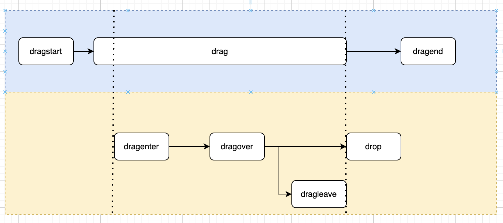
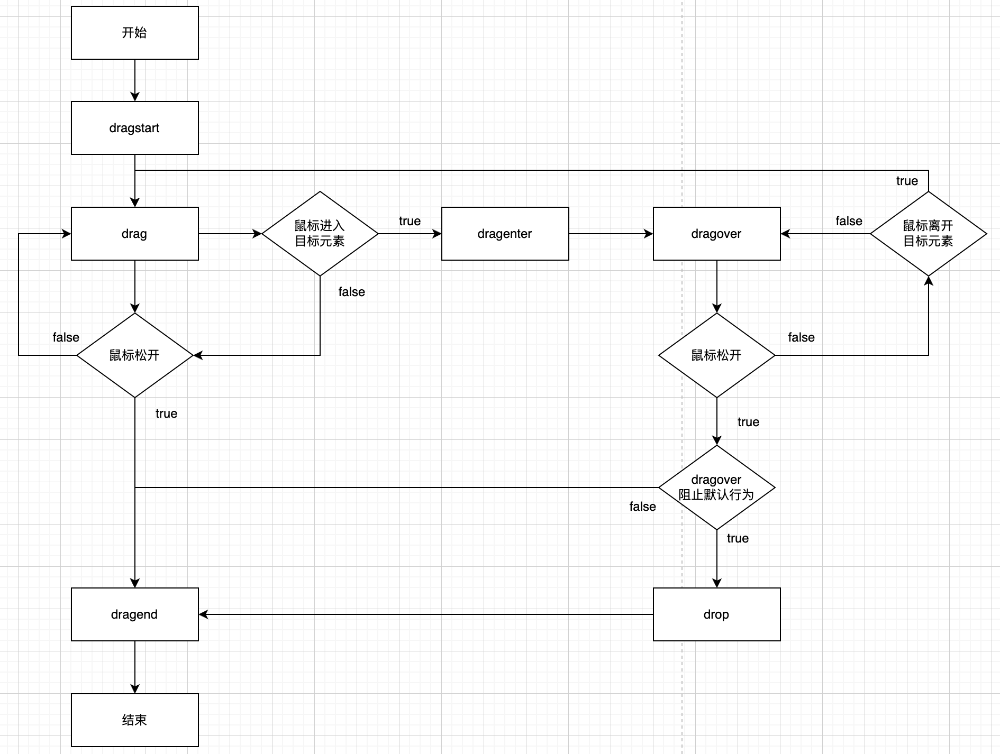

# Drag

## draggable属性

`draggable`是枚举属性，而非布尔属性。用于标识元素是否支持浏览器原生拖拽能力以及拖拽API。

- true：元素可拖拽。
- false：元素不可拖拽。

```html
<div draggable="true">可拖拽元素</div>
<div draggable="false">不可拖拽元素</div>
```


## 默认可拖拽元素

1. `a元素`
2. `img元素`


## 被拖拽元素

### 生命周期

- 拖拽开始：鼠标按下开始移动那一瞬
- 拖拽进行中：鼠标开始移动后，直到拖拽结束
- 拖拽结束：鼠标松开那一瞬

```javascript
const dragDom = document.querySelector('.drag');
// 被拖拽元素事件
dragDom.addEventListener('dragstart', (e) => {
    // 鼠标按下开始移动那一瞬触发，仅触发一次
});
dragDom.addEventListener('drag', (e) => {
    // 鼠标开始移动后不断触发，直到鼠标松开
});
dragDom.addEventListener('dragend', (e) => {
    // 鼠标松开那一瞬触发，仅触发一次
});
```


## 目标元素

### 生命周期

- 拖拽进入目标元素：鼠标进入目标元素那一瞬。
- 目标元素中：鼠标进入目标元素后。
- 放入目标元素：在目标元素中鼠标松开那一瞬
- 离开目标元素：鼠标离开目标元素那一瞬。

```javascript
const targetDom = document.querySelector('.target');
targetDom.addEventListener('dragenter', (e) => {
    // 鼠标进入目标元素那一瞬触发
});
targetDom.addEventListener('dragover', (e) => {
    // 鼠标进入目标元素后不断触发，直到鼠标松开或离开目标元素
});
targetDom.addEventListener('drop', (e) => {
    // 在目标元素中，鼠标松开那一瞬触发，仅触发一次
    // 是否触发，取决于dragover处理程序中是否阻止事件默认行为：元素在鼠标松开后立即返回原位
});
targetDom.addEventListener('dragleave', (e) => {
    // 鼠标离开目标元素那一瞬触发
});
```

**注意**：所有的元素，当拖拽周期结束时，默认事件行为是被拖拽元素回到原处。若要阻止被拖拽元素回到原处，可以在**目标元素**的**`dragover`**事件中，阻止事件默认行为。这样目标元素的**`drop`**事件也能触发。

事件是由行为触发的，而一个行为不止触发一个事件。

## 被拖拽元素与拖拽元素






## 事件对象中[dataTransfer](https://developer.mozilla.org/zh-CN/docs/Web/API/DataTransfer)属性

### 设置拖拽鼠标样式

- 在被拖拽元素的**`dragstart`**事件中设置**`effectAllowed`**属性。
- 在目标元素的**`drop`**事件中设置**`dropEffect`**属性。
- **`effectAllowed`** 和 **`dropEffect`**属性值最好一致。   

```javascript
dragDom.addEventListener('dragstart', (e) => {
	// 鼠标按下，移动那一瞬触发，仅触发一次
	e.dataTransfer.effectAllowed = 'link';
    console.log('dragstart');
});
targetDom.addEventListener('drop', (e) => {
    // 鼠标在目标元素内松开那一瞬触发，仅触发一次。注意：需在dragover中阻止事件默认行为（被拖拽元素返回原位），才会触发
    e.dataTransfer.dropEffect = 'move';
    console.log('drop');
});
```

